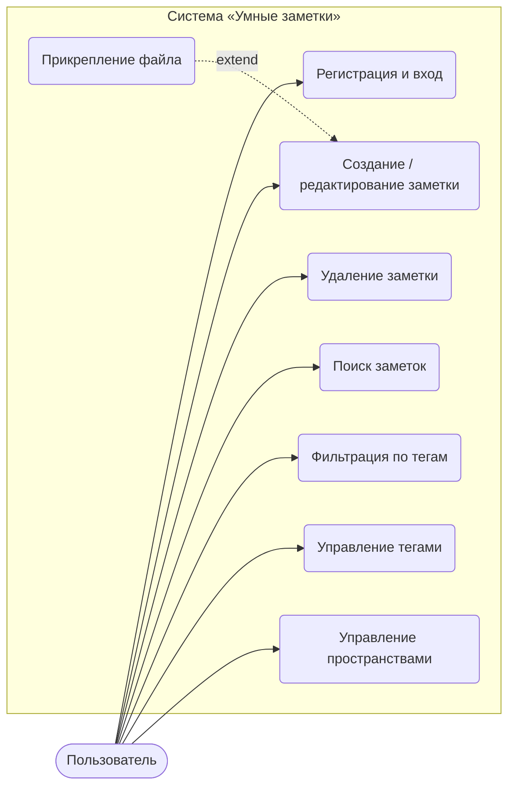
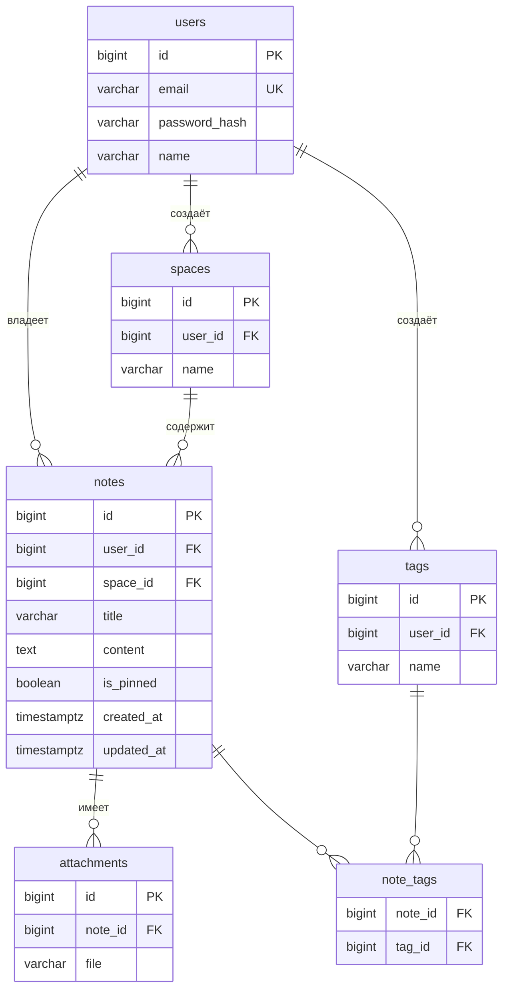
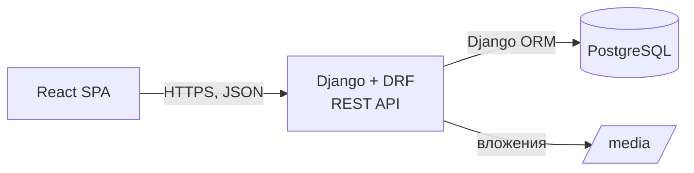

# Умные заметки

Веб-приложение для заметок без лишнего. Будет реализовано: пространства, теги, закреп и нормальный поиск. Учебный командный проект, группа ЭФБО-08-24, РТУ МИРЭА.

Популярные заметочники либо обросли функциями, в которых теряешься, либо режут бесплатный тариф. Мы делаем наоборот: минимум экранов, быстрый поиск, заметки видит только владелец.

---

- [Техническое задание](#техническое-задание)
- [Модель данных](#модель-данных)
- [Архитектура](#архитектура)
- [Стек](#стек)
- [API](#api)
- [Команда и роли](#команда-и-роли)
- [Структура репозитория](#структура-репозитория)
- [Запуск](#запуск)
- [Как мы работаем с git](#как-мы-работаем-с-git)

---

## Техническое задание

### Что входит в MVP

Регистрация и вход, CRUD заметок, пространства, теги, поиск, фильтры, закреп и вложения.

### Что точно не делаем в первой версии

Совместное редактирование, мобильное приложение, офлайн-режим.

### Функциональные требования

| ID | Требование | Как проверяем, что готово |
|----|-----------|---------------------------|
| FR-01 | Регистрация, вход и выход | Можно зарегистрироваться по email, войти, выйти. После выхода токен больше не работает |
| FR-02 | Создание, просмотр, редактирование и удаление заметок | У заметки есть заголовок и текст, `updated_at` меняется при сохранении |
| FR-03 | Пространства | Пользователь создаёт пространства и переносит в них заметки. Названия внутри одного аккаунта не повторяются |
| FR-04 | Теги | На заметку можно повесить несколько тегов и снять любой из них. Один тег используется в разных заметках |
| FR-05 | Поиск по заголовку и тексту | Находит по части слова и по словоформе («заметки» → «заметка») |
| FR-06 | Фильтры и сортировка | Фильтр по тегам и пространству, сортировка по дате создания и изменения, фильтры комбинируются с поиском |
| FR-07 | Закреп | Закреплённые заметки всегда выше остальных при любой сортировке |
| FR-08 | Вложения | К заметке можно прикрепить файл, скачать его и удалить. Удалили заметку — файлы тоже удалились |

### Нефункциональные требования

| ID | Требование |
|----|-----------|
| NFR-01 | Поиск отвечает не дольше 1 секунды (проверяем на базе ~10 000 заметок) |
| NFR-02 | Пароли хранятся только в виде хеша, всё ходит по HTTPS, чужие заметки недоступны: на запрос к чужому id сервер отвечает 404 |
| NFR-03 | Интерфейс нормально выглядит и на десктопе, и на телефоне (от 360px) |
| NFR-04 | Интерфейсом можно пользоваться без инструкции |

### Сценарии использования



---

## Модель данных

Пять сущностей. Теги с заметками связаны «многие ко многим» через `note_tags` (в Django это `ManyToManyField`, отдельную модель руками не пишем).



Пара решений, о которых лучше знать заранее:

- `user_id` лежит прямо в `notes`, `spaces` и `tags`. Так проверка «это твоё?» делается одним условием в запросе, без джойнов.
- `unique(user_id, name)` на пространствах и тегах.
- `space_id` может быть пустым: заметка без пространства просто лежит в общем списке. При удалении пространства заметки не пропадают, у них обнуляется `space_id`.
- Для поиска в `notes` есть `GIN`-индекс по `to_tsvector('russian', title || ' ' || content)`. Заголовок весит больше текста.

---

## Архитектура

Монолит клиент-сервер.



Фронт ничего не знает про базу, бэк ничего не знает про вёрстку. Общаются только через API из раздела ниже, и этот контракт меняется только через B.

---

## Стек

| Слой | Что используем | Зачем |
|------|----------------|-------|
| Фронтенд | React 19, TypeScript, Vite | Компоненты, типы ловят ошибки с API ещё до запуска |
| | React Router | Роутинг между страницами |
| | TanStack Query + axios | Запросы, кеш, повторная загрузка после изменений |
| | CSS Modules | Стили без конфликтов имён, без лишних зависимостей |
| Бэкенд | Python 3.12, Django 5.2 LTS | ORM, миграции, админка из коробки |
| | Django REST Framework | REST API, сериализаторы, пагинация |
| | djangorestframework-simplejwt | JWT-авторизация, blacklist refresh-токенов для выхода |
| | django-filter | Фильтры по тегам, пространству и датам через query-параметры |
| | drf-spectacular | OpenAPI-схема и Swagger UI по адресу `/api/docs/` |
| База | PostgreSQL 17 | Реляционная, и полнотекстовый поиск уже встроен, Elasticsearch не нужен |
| Инфраструктура | Docker, Docker Compose | Одна команда — и у всех одинаковое окружение |
| | Nginx | HTTPS и раздача статики на стенде |
| | GitHub Actions | Линтеры и тесты на каждый PR |
| Качество | pytest, pytest-django | Тесты бэкенда |
| | Vitest, Testing Library | Тесты фронта |
| | ruff, ESLint, Prettier | Единый стиль кода, споры про пробелы закрыты |

---

## API

Все адреса начинаются с `/api/`. Кроме регистрации и входа, всё требует заголовок `Authorization: Bearer <access>`. Полная схема живёт в Swagger: `http://localhost:8000/api/docs/`.

| Метод | Адрес | Что делает |
|-------|-------|-----------|
| POST | `/auth/register` | Регистрация |
| POST | `/auth/login` | Вход, отдаёт `access` и `refresh` |
| POST | `/auth/refresh` | Новый `access` по `refresh` |
| POST | `/auth/logout` | Выход, `refresh` уходит в blacklist |
| GET / POST | `/notes` | Список заметок / создание |
| GET / PUT / PATCH / DELETE | `/notes/{id}` | Одна заметка. Закреп — это `PATCH` с `{"is_pinned": true}` |
| GET / POST | `/notes/{id}/attachments` | Вложения заметки |
| DELETE | `/attachments/{id}` | Удалить вложение |
| GET / POST | `/spaces` | Пространства |
| PUT / DELETE | `/spaces/{id}` | Переименовать / удалить |
| GET / POST | `/tags` | Теги |
| DELETE | `/tags/{id}` | Удалить тег |

Параметры списка заметок, их можно комбинировать:

```
GET /api/notes?search=отчёт&space=3&tags=1,4&ordering=-updated_at&page=2
```

`ordering` принимает `created_at`, `updated_at` и их варианты с минусом. Закреплённые всё равно идут первыми.

---

## Команда и роли

Роли по буквам: буква нужна в названии ветки и в коммитах, чтобы сразу было видно, чья это зона.

### A — Евтушенко Егор, TeamLead

- Бэклог, распределение задач, сроки
- Репозиторий: ветки, защита `main`, ревью и мерж всех PR
- `docker-compose.yml`, `.env.example`, Dockerfile'ы, CI в GitHub Actions
- `backend/config/` (settings, urls), настройка PostgreSQL, команда `seed` с тестовыми данными
- Сборка перед показом

### B — Лимонов Никита, системный аналитик и архитектор

- Всё в `docs/`: требования, диаграммы, ER-модель
- Контракт API. Любое изменение эндпоинта или формата ответа сначала согласуется с B
- Критерии приёмки к каждой задаче (колонка «Как проверяем» в ТЗ — отсюда)
- Тест-кейсы и приёмка фич перед мержем в `dev`

### C — Прошин Никита, фронтенд

- Всё в `frontend/`
- Страницы: вход и регистрация, список заметок с поиском и фильтрами, редактор, управление пространствами и тегами
- Слой `src/api/` — единственное место, где фронт ходит в бэкенд
- Адаптивная вёрстка (NFR-03)

### D — Асаков Вячеслав, бэкенд

- Всё в `backend/apps/`
- Модели, миграции, сериализаторы, вьюхи, права доступа
- Полнотекстовый поиск и фильтры
- Загрузка и удаление вложений
- Тесты API, особенно на изоляцию данных между пользователями (NFR-02)

Правило одно: у каждой папки есть хозяин. В чужую зону лезем через PR с ревью хозяина, а не тихо в своей ветке.

---

## Запуск

Нужны Docker и Docker Compose. Больше ничего ставить не надо.

```bash
git clone <url-репозитория> smart-notes
cd smart-notes
cp .env.example .env
docker compose up --build
```

В соседнем терминале, один раз после первого запуска:

```bash
docker compose exec backend python manage.py migrate
docker compose exec backend python manage.py createsuperuser
docker compose exec backend python manage.py seed   # тестовые заметки, по желанию
```

Что где открывается:

| Что | Адрес |
|-----|-------|
| Фронтенд | http://localhost:5173 |
| API | http://localhost:8000/api/ |
| Swagger | http://localhost:8000/api/docs/ |
| Админка Django | http://localhost:8000/admin/ |

### Без Docker

Если хочется гонять бэк или фронт локально, например ради отладчика в IDE. База всё равно удобнее в докере: `docker compose up db`.

```bash
# бэкенд
cd backend
python -m venv .venv
source .venv/bin/activate        # Windows: .venv\Scripts\activate
pip install -r requirements.txt
python manage.py migrate
python manage.py runserver

# фронтенд
cd frontend
npm install
npm run dev
```
